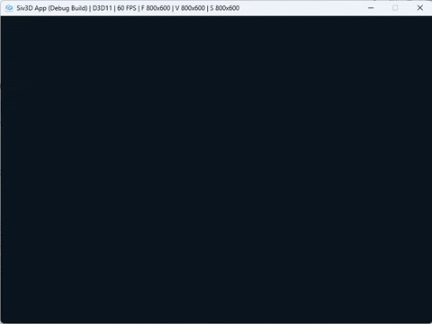
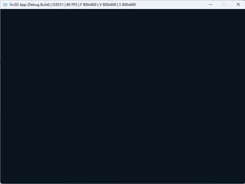

# CoTaskLib for Siv3D
Siv3D用コルーチンタスクライブラリ。ヘッダオンリー。

C++20の`co_await`/`co_return`キーワードを利用して、複数フレームにまたがる処理を見通しの良いシンプルなコードで実装できます。

本ライブラリは基本的にメインスレッドのみで動作するため、Siv3Dのメインスレッド専用の各種機能も問題なく使用できます。

## 時間待ちのサンプル


```cpp
#include <Siv3D.hpp>
#include <CoTaskLib.hpp>

Co::Task<> MainTask()
{
    Print << U"Hello,";
    co_await Co::Delay(1s); // 1秒待つ

    Print << U"World!";
    co_await Co::Delay(1s); // 1秒待つ

    Print << U"Hello,";
    co_await Co::Delay(1s); // 1秒待つ

    Print << U"CoTaskLib!";
}

void Main()
{
    Co::Init();

    const auto _ = MainTask().runScoped();
    while (System::Update())
    {
    }
}
```

## ダイアログ表示のサンプル



```cpp
#include <Siv3D.hpp>
#include <CoTaskLib.hpp>

Co::Task<> MainTask()
{
    co_await Co::SimpleDialog(U"こんにちは！\n私はCoTaskLibのサンプルプログラムです。");

    const Array<String> yesNoButtons{ U"はい", U"いいえ" };

    // 「はい」を選ぶまで質問ダイアログを出し続ける
    while (true)
    {
        const String choice = co_await Co::SimpleDialog(U"C++はお好きですか？", yesNoButtons);
        if (choice == U"はい")
        {
            // 「はい」を選択した場合、ループを抜ける
            co_await Co::SimpleDialog(U"素晴らしい！行ってよろしい。");
            break;
        }
        else
        {
            // 「いいえ」を選択した場合、ループ継続
            co_await Co::SimpleDialog(U"よく聞こえませんでしたねえ！\nもう一度聞きますね？？");
        }
    }
}

void Main()
{
    Co::Init();

    const auto _ = MainTask().runScoped();
    while (System::Update())
    {
    }
}
```

## 主な機能一覧
- タスク(`Co::Task`):
    - 複数フレームにまたがる処理を1つの関数として記述できます
    - 戻り値を返すこともできます
- シーケンス(`Co::SequenceBase`):
    - タスクに加えて、毎フレームの描画処理(draw関数)を実装できます
    - 必要に応じて、フェードイン・フェードアウト処理を実装するための仮想関数も用意されています
    - タスクと同様、戻り値を返すこともできます
- シーン(`Co::SceneBase`)
    - ゲーム内のシーンをタスクで記述できます
    - シーン同士は互いに遷移できます。それ以外の使い方はシーケンスとほぼ同じです
- Updater(`Co::UpdaterTask`、`Co::UpdaterSeqenceBase`、`Co::UpdaterSceneBase`)
    - 毎フレームの処理(update関数)で記述した既存処理を、そのままタスク・シーケンス・シーンとして移植できます
- ダイアログ(`Co::SimpleDialog`)
    - 画面内にダイアログを表示できます
- イージング(`Co::Ease`)
    - 変数の値を時間をかけて滑らかに推移できます
- トゥイーン(`Co::Tweener`)
    - 描画位置・スケール・不透明度・色などを時間をかけて滑らかに推移できます
- 文字送り(`Co::Typewriter`)
    - ノベルゲームのように文字列を1文字ずつ表示する処理が簡単に実装できます
- Siv3D標準の非同期タスク機能(`s3d::AsyncTask`/`s3d::AsyncHTTPTask`)との連携
    - `co_await`キーワードでタスクの代わりとしてそのまま使用できます

## `Co::Task<TResult>`クラス
コルーチンで実行するタスクを表すクラスです。結果の型はテンプレートパラメータ`TResult`で指定します。
結果が不要な場合は、`Co::Task<>`(`Co::Task<void>`と同じ)を使用します。

#### 戻り値がない場合の例:
下記は、マウスが左クリックされるまで待つ簡単な例です。

```cpp
Co::Task<> ExampleTask()
{
    // マウスクリックされるまで待機
    co_await Co::WaitUntilDown(MouseL);

    Print << U"クリックされました！";
}
```

#### 戻り値がある場合の例:
下記は、マウスが左クリックまたは右クリックされるまで待ち、どちらが押されたかに応じて文字列を返す例です。

```cpp
Co::Task<String> ExampleTaskWithResult()
{
    // 左クリックまたは右クリックされるまで待機
    const auto [isMouseL, isMouseR] = co_await Co::Any(
        Co::WaitUntilDown(MouseL),
        Co::WaitUntilDown(MouseR));

    // どちらが押されたかに応じて、文字列を返す
    if (isMouseL)
    {
        co_return U"クリックされました！";
    }
    else
    {
        co_return U"右クリックされました！";
    }
}
```

### コルーチン制御
`Co::Task`を戻り値とするコルーチン関数内で、下記のキーワードによってコルーチンを制御できます。なお、本ライブラリでは`co_yield`は使用されません。

- `co_await`: 他の`Co::Task`を実行し、その完了を待ちます。結果がある場合はそれを返します。
- `co_return`: `TResult`型の結果を返します。

### メンバ関数
下記のメンバ関数を使用してタスクの実行を制御できます。

- `runScoped()` -> `Co::ScopedTaskRunner`
    - タスクの実行を開始し、`Co::ScopedTaskRunner`(生存期間オブジェクト)のインスタンスを返します。
    - タスクの実行が完了する前に`Co::ScopedTaskRunner`が破棄されると、タスクは中断されます。
        - メモリ安全性のためには、タスク内で外部変数を参照する際は、それが`Co::ScopedTaskRunner`よりも生存期間が長いことを確認してください。
    - 必要に応じて、タスク実行の完了時・中断時に実行するコールバック関数を指定することもできます。
        - 第1引数: タスク完了時のコールバック関数(`std::funciton<void(const TResult&)>`)
        - 第2引数: タスク中断時のコールバック関数(`std::function<void()>`)
- `with(Co::Task)` -> `Co::Task<TResult>`
    - タスク実行中に別のタスクを同時実行することができます。
    - 子タスクの完了は待ちません。親タスクが先に完了した場合、子タスクの実行は中断されます。
    - 子タスクの戻り値は無視されます。
    - この関数は複数回呼び出して、複数のタスクを登録することも可能です。その場合、毎フレームの処理は登録した順序で実行されます。
- `pausedIf(std::function<bool()>)` -> `Co::Task<TResult>`
    - 与えられた関数オブジェクトを毎フレーム実行し、結果がtrueの間、タスク実行を一時停止します。
    - 一時停止中はタスクの更新が停止し、コルーチン実行が再開されません。
        - `Co::NextFrame`等の中断ポイントで停止したままの状態となります。
    - タスク内から`co_await`で実行している子タスクに対しても再帰的に一時停止されます。
        - ただし、タスク内から`co_await`ではなく`runScoped`関数を使用して実行した場合は親子関係のない別タスクとして実行されているため、それらのタスクは一時停止されません。
    - `Co::Delay`、`Co::Ease`、`Co::Tween`、`Co::Typewriter`が一時停止された場合、一時停止中は時間経過していない扱いとして処理されます。
    - シーケンスおよびシーンの`draw`関数は、タスクが一時停止中の間も実行されます(実行開始前からあらかじめ一時停止にしておりタスク実行が開始していない場合を除く)。
- `delayed(Duration)` -> `Co::Task<TResult>`
    - 指定時間だけ遅らせて実行開始されるタスクを返します。
- `discardResult()` -> `Co::Task<>`
    - 戻り値を破棄した、戻り値のないタスクを返します。

### タスクの実行方法

#### 通常の関数内から実行開始する場合
`runScoped`関数を使用します。

```cpp
const auto runner = ExampleTask().runScoped();
```

上記で取得した`runner`変数(`Co::ScopedTaskRunner`型)は、タスク実行の生存期間オブジェクトです。この変数が有効な間、タスクがバックグラウンドで実行されます。もし`runner`が破棄されると、タスクの実行も中断されます。

#### コルーチン内から実行する場合
`co_await`を使用して`Co::Task`を子タスクとして実行し、完了まで待機することができます。

```cpp
co_await ExampleTask();
```

完了を待つ必要がない場合、`runScoped`関数を併用することもできます。

```cpp
Co::Task<> ExampleTask()
{
    // Task1とTask2を同時に実行開始し、10秒間経ったらタスクの完了を待たずに終了
    const auto taskRunner1 = Task1().runScoped();
    const auto taskRunner2 = Task2().runScoped();

    co_await Co::Delay(10s);
}
```

(補足) 複数のタスクを同時に実行したい場合、`with`関数や`Co::All`関数も利用できます。

```cpp
Co::Task<> ExampleTask()
{
    // Task1とTask2を同時に実行し、Task1が完了するまで待機
    // (Task1の実行が完了したタイミングでTask2の実行は途中で終了される)
    co_await Task1().with(Task2());
}
```
```cpp
Co::Task<> ExampleTask()
{
    // Task1とTask2を同時に実行し、両方完了するまで待機
    co_await Co::All(Task1(), Task2());
}
```

## `Co::SequenceBase<TResult>`クラス
シーケンスの基底クラスです。シーケンスとは、タスクと描画処理(draw関数)を組み合わせたものです。  
描画を含むタスクを作成する場合は、このクラスを継承してください。

シーケンス同士は`co_await`を利用して入れ子構造にできます。そのため、単純なシーケンスを複数組み合わせて複雑なシーケンスを作成することができます。

```cpp
class ExampleSequence : public Co::SequenceBase<>
{
private:
    Co::Task<> start() override
    {
        // ここに処理をコルーチンで記述
        co_return;
    }

    void draw() const override
    {
        // ここに毎フレームの描画処理を記述
    }

    Co::Task<> fadeIn() override
    {
        // 必要に応じて、フェードイン処理をコルーチンで記述(startと同時に実行される)
        co_return;
    }

    Co::Task<> fadeOut() override
    {
        // 必要に応じて、フェードアウト処理をコルーチンで記述(startの完了後に実行される)
        co_return;
    }
};
```

### 仮想関数
下記の仮想関数をオーバーライドできます。`start()`のみが必須で、それ以外は必要に応じてオーバーライドしてください。

- `start()` -> `Co::Task<TResult>`
    - シーケンス開始時に実行されるコルーチンです。
    - `co_return`で`TResult`型の結果を返します。

- `draw() const`
    - シーケンスの描画処理を記述します。
    - この関数は、毎フレーム実行されます。
        - `start`関数内で`co_await`を使用して別のコルーチンの実行完了まで待機している間も、`draw`関数は実行され続けます。

- `fadeIn()` -> `Co::Task<>`
    - シーケンス開始時に実行されるフェードイン用のコルーチンです。
    - `start()`と同時に実行されます。もし同時に実行したくない場合は、`start()`内の先頭で`co_await waitForFadeIn()`を実行し、フェードイン完了まで待機してください。
    - `fadeIn()`の実行が完了する前に`start()`および`fadeOut()`が実行完了した場合、`fadeIn()`の実行は途中で終了されます。

- `fadeOut()` -> `Co::Task<>`
    - シーケンス終了時に実行されるフェードアウト用のコルーチンです。
    - `start()`の完了後に実行されます。
    - `fadeOut()`内で`start()`の戻り値に応じて別々のフェードアウトを実装したい場合、`result()`を使用して結果を取得できます。

- `preStart()` -> `Co::Task<>`
    - `start()`および`fadeIn()`より前に呼び出されるコルーチンです。
    - ローディング処理を複数フレームにわたって実行する場合など、フェードイン開始より前に何か処理を実行したい場合に使用します。
    - Tips: 変数の初期化など、コルーチンで実装する必要がない処理は、`preStart()`関数を使用せずシーケンスクラスのコンストラクタ内に処理を記述するのが良いでしょう。

- `preStartDraw() const`
    - `preStart()`の実行中に毎フレーム呼び出される描画処理です。

- `postFadeOut()` -> `Co::Task<>`
    - `fadeOut()`より後に呼び出されるコルーチンです。
    - フェードアウト後に何か処理を実行したい場合に使用します。

- `postFadeOutDraw() const`
    - `postFadeOut()`の実行中に毎フレーム呼び出される描画処理です。

### シーケンスの実行方法

#### 通常の関数内から実行開始する場合
`Co::Play`関数を使用することで、シーケンスを再生する`Co::Task`を取得できます。これに対して通常通り、`runScoped`関数を使用します。  
もしシーケンスクラスのコンストラクタに引数が必要な場合、`Co::Play`関数の引数として渡すことができます。

```cpp
const auto runner = Co::Play<ExampleSequence>().runScoped();
```

上記の方法では、シーケンスのインスタンスへ外部からアクセスすることはできません。  
もしタスク実行中に外部からシーケンスのインスタンスへ操作が必要な場合は、下記のように`playScoped()`関数を使用します。

```cpp
ExampleSequence exampleSequence{};
const auto runner = exampleSequence.playScoped();

// シーケンスクラスのインスタンスへ操作可能(※一例)
exampleSequence.setText(U"テキスト");
```

#### コルーチン内から実行する場合
`Co::Play`関数でシーケンスを再生する`Co::Task`を取得し、これに対して`co_await`を使用します。

```cpp
Co::Task<> ExampleTask()
{
    co_await Co::Play<ExampleSequence>(); // ExampleSequenceを再生し、完了まで待機します
}
```

上記の方法では、シーケンスのインスタンスへ外部からアクセスすることはできません。  
もしタスク実行中に外部からシーケンスのインスタンスへ操作が必要な場合は、下記のように`play()`関数を使用します。

```cpp
Co::Task<> ExampleTask()
{
    ExampleSequence exampleSequence{};
    co_await exampleSequence.play();

    // シーケンスクラスのインスタンスへ操作可能(※一例)
    exampleSequence.setText(U"テキスト");
}
```

シーケンスクラスの同一インスタンスに対して`play()`や`playScoped()`で再生できるのは1回のみです。同一インスタンスに対して複数回`play()`を呼び出すことは許可されていません。複数回再生しようとすると`s3d::Error`例外が送出されます。

### 注意点
シーケンスの実行時には、`start`関数を外部から直接呼び出すことは想定されていません。`start`関数を直接呼び出すと、それ以外の関数(`draw`関数など)に記述した処理が実行されなくなります。

このような誤操作を防ぐために、`start`関数などをオーバーライドする際はアクセス指定子をprivate(継承を想定する場合はprotected)にしておくことを推奨します。

```cpp
class ExampleSequence : public Co::SequenceBase<>
{
private: // 基本的にprivateにしておくことを推奨
    Co::Task<> start() override
    {
        co_return;
    }
};
```

### 描画順序の制御方法
シーケンス同士の描画順序(`draw`関数が実行される順序)は、デフォルトではシーケンスの開始順です。そのため、後に開始されたシーケンスの方が前面に描画されます。

これで問題になるケースはさほど多くないですが、レイヤーまたはdrawIndexを設定することで明示的に描画順序を制御することが可能です。

#### レイヤー(layer)
レイヤーを使用することで、大まかな描画順を制御できます。`Co::Layer`型の列挙子で指定します。

CoTaskLibでは標準で下記のレイヤーが定義されており、上から順に描画されます。
- `Co::Layer::Default`: デフォルトのレイヤーです。
- `Co::Layer::Modal`: ダイアログなどのモーダルを表示するためのレイヤーです。
- `Co::Layer::Transition_FadeIn`: 画面全体のフェードインのトランジションを表示するためのレイヤーです。
- `Co::Layer::Transition_General`: 画面全体の一般的なトランジションを表示するためのレイヤーです。
- `Co::Layer::Transition_FadeOut`: 画面全体のフェードアウトのトランジションを表示するためのレイヤーです。
- `Co::Layer::Debug`: デバッグ情報を表示するためのレイヤーです。最前面に描画されます。

※他にもユーザー定義用のレイヤーがありますが、そちらは後述します。

下記のように、`SequenceBase`クラスのコンストラクタの第1引数にレイヤーを指定することができます。

```cpp
class ModalExample : public Co::SequenceBase<>
{
public:
    ModalExample()
        : Co::SequenceBase(Co::Layer::Modal) // Modalレイヤーを指定
    {
    }

private:
    // ... (シーケンスの実装内容はここでは記載省略)
};
```

シーケンス実行の途中でレイヤーを変更することもできます。途中で変更したい場合は、下記のようにシーケンスクラス内で`setLayer`関数を実行します。

```cpp
class ModalExample : public Co::SequenceBase<>
{
private:
    Co::Task<> start() override
    {
        // ... (何らかの処理)

        // レイヤーを変更
        setLayer(Co::Layer::Modal);
    }
};
```

なお、ModalレイヤーおよびTransition系レイヤーには、表示中のものがあるかどうかを下記の関数で取得することができます。  
これを利用することで、モーダル表示中やトランジション中は特定の操作を無効にするといった実装が可能です。

- `Co::HasActiveModal()`: Modalレイヤーに表示中のものがあるかどうかを返します。
- `Co::HasActiveTransition()`: Transition系のレイヤーに表示中のものがあるかどうかを返します。
- `Co::HasActiveFadeInTransition()`: Transition_FadeInレイヤーに表示中のものがあるかどうかを返します。
- `Co::HasActiveGeneralTransition()`: Transition_Generalレイヤーに表示中のものがあるかどうかを返します。
- `Co::HasActiveFadeOutTransition()`: Transition_FadeOutレイヤーに表示中のものがあるかどうかを返します。

他にも、`Co::Layer`には自由な用途で利用できる、ユーザー定義用のレイヤーの列挙子が用意されています。  
これらの値を必要に応じて`Co::Layer`型の定数として定義することで、名前を付けて使用できます。

- `Co::Layer::User_PreDefault_1`～`User_PreDefault_10`: Defaultレイヤーの背面に描画される、ユーザー定義用のレイヤーです。
- `Co::Layer::User_PostDefault_1`～`User_PostDefault_10`: Defaultレイヤーの前面に描画される、ユーザー定義用のレイヤーです。
- `Co::Layer::User_PostModal_1`～`User_PostModal_10`: Modalレイヤーの前面に描画される、ユーザー定義用のレイヤーです。
- `Co::Layer::User_PostTransition_1`～`User_PostTransition_10`: Transition系レイヤーの前面に描画される、ユーザー定義用のレイヤーです。

```cpp
// ユーザー定義用のレイヤーを使用する際の定義例
namespace MyLayer
{
    constexpr Co::Layer ForegroundUI = Co::Layer::User_PostDefault_1;
    constexpr Co::Layer LoadingScreen = Co::Layer::User_PostTransition_1;
}
```

#### drawIndex
drawIndexは、同一レイヤー内での描画順序を指定するための値です。

`int32`型の自由な値で指定することができますが、意図をより明確にしたい場合は下記の定数を使用することもできます。
- `Co::DrawIndex::Back`(=-1): 背面に描画されます。
- `Co::DrawIndex::Default`(=0): デフォルトのdrawIndexです。
- `Co::DrawIndex::Front`(=1): 前面に描画されます。

下記のように、`SequenceBase`クラスのコンストラクタの第2引数にdrawIndexを指定することができます。

```cpp
class ModalExample : public Co::SequenceBase<>
{
public:
    ModalExample()
        : Co::SequenceBase(Co::Layer::Default, Co::DrawIndex::Front) // Defaultレイヤー内で前面(drawIndex=1)に表示
    {
    }

private:
    // ... (シーケンスの実装内容はここでは記載省略)
};
```

シーケンス実行の途中でdrawIndexを変更することもできます。途中で変更したい場合は、下記のようにシーケンスクラス内で`setDrawIndex`関数を実行します。

```cpp
class ModalExample : public Co::SequenceBase<>
{
private:
    Co::Task<> start() override
    {
        // ... (何らかの処理)

        // drawIndexを変更
        setDrawIndex(Co::DrawIndex::Front);
    }
};
```

## `Co::UpdaterSequenceBase<TResult>`クラス
`Co::UpdaterSequenceBase<TResult>`は、毎フレーム実行される`update()`関数を持つシーケンスの基底クラスです。コルーチンを使用せずにシーケンスを作成する場合にこのクラスを継承します。

コルーチン不使用の既存コードをなるべく変更せずにコルーチンから呼び出したい場合や、毎フレームの処理を記述する必要がある場合に便利です。

`Co::UpdaterSequenceBase`は`Co::SequenceBase`の派生クラスです。したがって、`Co::UpdaterSequenceBase`を継承した場合でもシーケンスの実行方法に違いはありません。

```cpp
class ExampleUpdaterSequence : public Co::UpdaterSequenceBase<>
{
private:
    void update() override
    {
        // ここに毎フレームの処理を記述

        // シーケンスを終了させたい場合はrequestFinish関数を呼ぶ
        requestFinish();
    }

    void draw() const override
    {
        // ここに毎フレームの描画処理を記述
    }

    Co::Task<> fadeIn() override
    {
        // 必要に応じて、フェードイン処理をコルーチンで記述(updateと同時に実行される)
        co_await Co::SimpleFadeIn(1s, Palette::Black);
    }

    Co::Task<> fadeOut() override
    {
        // 必要に応じて、フェードアウト処理をコルーチンで記述(updateの完了後に実行される)
        co_await Co::SimpleFadeOut(1s, Palette::Black);
    }
};
```

### 仮想関数
下記の仮想関数をオーバーライドできます。`update()`のみが必須で、それ以外は必要に応じてオーバーライドしてください。

- `update()`
    - 毎フレームの処理を記述します。
    - シーケンスを終了するには、`requestFinish()`関数を実行します。

- `draw() const`
    - シーケンスの描画処理を記述します。
    - この関数は、毎フレーム実行されます。
        - `start`関数内で別のコルーチンを`co_await`で待機している間も、`draw`関数は実行され続けます。

- `fadeIn()` -> `Co::Task<>`
    - シーン開始時に実行されるフェードイン用のコルーチンです。
    - `update()`と同時に実行されます。もし同時に実行したくない場合は、`update`関数内で`isFadingIn()`がtrueの場合は処理をスキップするなどしてください。
    - `fadeIn()`の実行が完了する前にシーン処理および`fadeOut()`が実行完了した場合、`fadeIn()`の実行は途中で終了されます。

- `fadeOut()` -> `Co::Task<>`
    - シーン終了時に実行されるフェードアウト用のコルーチンです。
    - `update()`内でシーン終了の関数が呼ばれた後に実行されます。

- `preStart()` -> `Co::Task<>`
    - `update()`および`fadeIn()`より前に呼び出されるコルーチンです。
    - ローディング処理を複数フレームにわたって実行する場合など、フェードイン開始より前に何か処理を実行したい場合に使用します。
    - Tips: 変数の初期化など、コルーチンで実装する必要がない処理は、`preStart()`関数を使用せずシーケンスクラスのコンストラクタ内に処理を記述するのが良いでしょう。

- `preStartDraw() const`
    - `preStart()`の実行中に毎フレーム呼び出される描画処理です。

- `postFadeOut()` -> `Co::Task<>`
    - `fadeOut()`より後に呼び出されるコルーチンです。
    - フェードアウト後に何か処理を実行したい場合に使用します。

- `postFadeOutDraw() const`
    - `postFadeOut()`の実行中に毎フレーム呼び出される描画処理です。

- `postFadeOut()` -> `Co::Task<>`
    - `fadeOut()`より後に呼び出されるコルーチンです。
    - フェードアウト後に何か処理を実行したい場合に使用します。

- `postFadeOutDraw() const`
    - `postFadeOut()`の実行中に毎フレーム呼び出される描画処理です。

### update関数からシーケンスを完了するには
`update()`関数内で`requestFinish()`関数を実行し、シーケンスを完了できます。
`requestFinish()`関数の引数には`TResult`型の結果を指定します。`TResult`が`void`型の場合、引数は不要です。

```cpp
void update() override
{
    if (...) // 何らかの条件
    {
        requestFinish();
        return;
    }
}
```

なお、`requestFinish()`関数が複数回呼ばれた場合、1回目の呼び出しで受け取った結果のみが使用され、2回目以降の呼び出し分は無視されます。

## `Co::SceneBase`クラス
シーンの基底クラスです。シーンを実装するには、このクラスを継承します。

シーンとは、例えばタイトル画面・ゲーム画面・リザルト画面など、ゲームの大まかな画面を表す単位です。

シーン機能を使用しなくてもゲームを作成することは可能ですが、シーン機能を使用することで画面間の遷移を簡単に実装することができます。

大まかにはシーケンスにシーン遷移のための機能が付いたもので、基本的な使用方法はシーケンスと同じです。

```cpp
class ExampleScene : public Co::SceneBase
{
private:
    Co::Task<> start() override
    {
        // ここに処理をコルーチンで記述

        // EnterキーかEscキーを押すまで待機
        const auto [isEnter, isEsc] = co_await Co::Any(
            Co::WaitUntilDown(KeyEnter),
            Co::WaitUntilDown(KeyEsc));

        if (isEnter)
        {
            // Enterキーを押したらゲームシーンへ遷移
            requestNextScene<GameScene>();
            co_return;
        }
        else
        {
            // Escキーを押したらシーン遷移を終了
            co_return;
        }
    }

    void draw() const override
    {
        // ここに毎フレームの描画処理を記述
    }

    Co::Task<> fadeIn() override
    {
        // 必要に応じて、フェードイン処理をコルーチンで記述(startと同時に実行される)
        co_await Co::ScreenFadeIn(1s, Palette::Black);
    }

    Co::Task<> fadeOut() override
    {
        // 必要に応じて、フェードアウト処理をコルーチンで記述(startの完了後に実行される)
        co_await Co::ScreenFadeOut(1s, Palette::Black);
    }
};
```

### 仮想関数
下記の仮想関数をオーバーライドできます。`start()`のみが必須で、それ以外は必要に応じてオーバーライドしてください。

- `start()` -> `Co::Task<>`
    - シーン開始時に実行されるコルーチンです。

- `draw() const`
    - シーンの描画処理を記述します。
    - この関数は、毎フレーム実行されます。
        - `start`関数内で`co_await`を使用して別のコルーチンの実行完了まで待機している間も、`draw`関数は実行され続けます。

- `fadeIn()` -> `Co::Task<>`
    - シーン開始時に実行されるフェードイン用のコルーチンです。
    - `start()`と同時に実行されます。もし同時に実行したくない場合は、`start()`内の先頭で`co_await waitForFadeIn()`を実行し、フェードイン完了まで待機してください。
    - `fadeIn()`の実行が完了する前に`start()`および`fadeOut()`が実行完了した場合、`fadeIn()`の実行は途中で終了されます。

- `fadeOut()` -> `Co::Task<>`
    - シーン終了時に実行されるフェードアウト用のコルーチンです。
    - `start()`の完了後に実行されます。
    - Tips: フェードアウトは必ずしも`fadeOut()`関数内に実装する必要はありません。遷移先のシーンごとにフェードアウトの方法を変えたい場合など、`fadeOut()`関数を使用せずに`start()`関数内でフェードアウトを実行した方がシンプルに実装できる場合があります。

- `preStart()` -> `Co::Task<>`
    - `start()`および`fadeIn()`より前に呼び出されるコルーチンです。
    - ローディング処理を複数フレームにわたって実行する場合など、フェードイン開始より前に何か処理を実行したい場合に使用します。
    - Tips: 変数の初期化など、コルーチンで実装する必要がない処理は、`preStart()`関数を使用せずシーンクラスのコンストラクタ内に処理を記述するのが良いでしょう。

- `preStartDraw() const`
    - `preStart()`の実行中に毎フレーム呼び出される描画処理です。

- `postFadeOut()` -> `Co::Task<>`
    - `fadeOut()`より後に呼び出されるコルーチンです。
    - フェードアウト後に何か処理を実行したい場合に使用します。

- `postFadeOutDraw() const`
    - `postFadeOut()`の実行中に毎フレーム呼び出される描画処理です。

### シーンの実行方法
`Co::PlaySceneFrom`関数を開始シーンの型を指定して呼び出すことで、最初のシーンから最後のシーンまでの一連の動作を実行する`Co::Task<>`を取得できます。これに対して通常通り、`runScoped`関数を使用します。  
もし開始シーンのクラスのコンストラクタに引数が必要な場合、`Co::PlaySceneFrom`関数の引数として渡すことができます。

全てのシーンが終了した場合にプログラムを終了するためには、下記のように`done()`関数でタスクの完了を確認してwhileループを抜けます。

```cpp
const auto runner = Co::PlaySceneFrom<ExampleScene>().runScoped();
while (System::Update())
{
    if (runner.done())
    {
        break;
    }
}
```

### 次のシーンの指定方法

次のシーンへ遷移するには、基底クラスに実装されている`requestNextScene()`関数を実行します。  
`requestNextScene()`関数は、`start()`関数をはじめ、それ以外のタイミングのコルーチン関数内やコンストラクタ内でも実行可能です。

- `requestNextScene<TScene>(...)`関数
    - シーンクラスを指定し、次のシーンへ遷移します。
    - `TScene`には次のシーンのクラスを指定します。`TScene`は`Co::SceneBase`の派生クラスである必要があります。
    - 引数には、`TScene`のコンストラクタの引数を指定します。
        - 指定した引数はそれぞれコピーされます。引数にコピー構築できない型が含まれる場合、コンパイルエラーとなります。

```cpp
Co::Task<> start() override
{
    // ... (何らかの処理)

    switch (selectedMenuItem)
    {
    case MenuItem::Start:
        requestNextScene<GameScene>();
        co_return;
    
    case MenuItem::Option:
        requestNextScene<OptionScene>();
        co_return;

    case MenuItem::Exit:
        // 何も指定しなかった場合は最終シーンとして扱われる
        co_return;
    }
}
```

### 描画順序の制御方法
シーンにおいても、シーケンスと同じ方法でレイヤー・drawIndexを指定して描画順序を制御できます。

詳細は「`Co::SequenceBase<TResult>`クラス」の節の「描画順序の制御方法」をご確認ください。

### Siv3D標準のシーン機能との比較

下記の点が異なります。

- CoTaskLibのシーン機能には、SceneManagerのようなマネージャークラスがありません。遷移先シーンのクラスは直接`Co::PlaySceneFrom()`関数または`requestNextScene()`関数のテンプレート引数として指定するため、シーン名の登録などが必要ありません。
- CoTaskLibでは、シーンクラスのコンストラクタに引数を持たせることができます。そのため、遷移元のシーンから必要なデータを受け渡すことができます。
    - Siv3D標準のシーン機能にある`getData()`のような、シーン間でグローバルにデータを受け渡すための機能は提供していません。代わりに、シーンクラスのコンストラクタに引数を用意して受け渡してください。
- CoTaskLibのシーンクラスでは、毎フレーム実行されるupdate関数の代わりに、`start()`関数というコルーチン関数を実装します。
    - update関数を使用したい場合、下記のいずれかの方法を使用してください。
        - 方法1: `SceneBase`クラスの代わりに`UpdaterSceneBase`クラスを基底クラスとして使用する(`UpdaterSceneBase`の詳細は後述)
        - 方法2: 自前で`update()`関数を用意し、`start()`関数内に`const auto runner = Co::UpdaterTask([this] { update(); }).runScoped();`と記述することで、`update()`関数が毎フレーム実行されるようにする
        - 方法3: `start()`関数内に`while (true) { /*毎フレーム実行したい処理*/ co_await NextFrame(); }`のように記述し、1フレームおきに処理が実行されるようにする

## `Co::UpdaterSceneBase`クラス

毎フレーム実行される`update()`関数を持つシーンの基底クラスです。コルーチンを使用しないシーンを作成する際は、このクラスを継承します。

Siv3D標準のシーン機能を使用して作成したシーンをなるべく変更せずに移植したい場合や、毎フレームの処理を記述した方が都合が良いシーンを作成する場合に便利です。

なお、`Co::UpdaterSceneBase`は`Co::SceneBase`の派生クラスです。`Co::UpdaterSceneBase`を継承した場合でもシーンの実行方法に違いはありません。

```cpp
class ExampleUpdaterScene : public Co::UpdaterSceneBase
{
private:
    void update() override
    {
        // ここに毎フレームの処理を記述

        if (KeyEnter.down())
        {
            // Enterキーを押したらゲームシーンへ遷移
            requestNextScene<GameScene>();
            return;
        }

        if (KeyQ.down())
        {
            // Qキーを押したらシーン遷移を終了
            requestSceneFinish();
            return;
        }
    }

    void draw() const override
    {
        // ここに毎フレームの描画処理を記述
    }

    Co::Task<> fadeIn() override
    {
        // 必要に応じて、フェードイン処理をコルーチンで記述(updateと同時に実行される)
        co_await Co::ScreenFadeIn(1s, Palette::Black);
    }

    Co::Task<> fadeOut() override
    {
        // 必要に応じて、フェードアウト処理をコルーチンで記述(updateの完了後に実行される)
        co_await Co::ScreenFadeOut(1s, Palette::Black);
    }
};
```

### 仮想関数
下記の仮想関数をオーバーライドできます。`update()`のみが必須で、それ以外は必要に応じてオーバーライドしてください。

- `update()`
    - 毎フレームの処理を記述します。

- `draw() const`
    - シーンの描画処理を記述します。
    - この関数は、毎フレーム実行されます。
        - `start`関数内で`co_await`を使用して別のコルーチンの実行完了まで待機している間も、`draw`関数は実行され続けます。

- `fadeIn()` -> `Co::Task<>`
    - シーン開始時に実行されるフェードイン用のコルーチンです。
    - `update()`と同時に実行されます。もし同時に実行したくない場合は、`update`関数内で`isFadingIn()`がtrueの場合は処理をスキップするなどしてください。
    - `fadeIn()`の実行が完了する前にシーン処理および`fadeOut()`が実行完了した場合、`fadeIn()`の実行は途中で終了されます。

- `fadeOut()` -> `Co::Task<>`
    - シーン終了時に実行されるフェードアウト用のコルーチンです。
    - `update()`内でシーン終了の関数が呼ばれた後に実行されます。

- `preStart()` -> `Co::Task<>`
    - `update()`および`fadeIn()`より前に呼び出されるコルーチンです。
    - ローディング処理を複数フレームにわたって実行する場合など、フェードイン開始より前に何か処理を実行したい場合に使用します。
    - Tips: 変数の初期化など、コルーチンで実装する必要がない処理は、`preStart()`関数を使用せずシーンクラスのコンストラクタ内に処理を記述するのが良いでしょう。

- `preStartDraw() const`
    - `preStart()`の実行中に毎フレーム呼び出される描画処理です。

- `postFadeOutDraw() const`
    - `postFadeOut()`の実行中に毎フレーム呼び出される描画処理です。

### シーンを完了するには
シーンを終了して次のシーンへ遷移するには、基底クラスに実装されている下記のいずれかの関数を実行します。

- `requestNextScene<TScene>(...)`関数
    - シーンクラスを指定し、次のシーンへ遷移します。
    - `TScene`には次のシーンのクラスを指定します。`TScene`は`Co::SceneBase`の派生クラスである必要があります。
    - 引数には、`TScene`のコンストラクタの引数を指定します。
        - 指定した引数はそれぞれコピーされます。引数にコピー構築できない型が含まれる場合、コンパイルエラーとなります。
- `requestSceneFinish()`関数
    - シーンを完了し、次のシーンへ遷移しません。

`Co::UpdaterSceneBase`では、次シーンのリクエスト操作が`update()`の終了条件にも使用されます。そのため、通常の`Co::SceneBase`とは異なり`update()`より後に実行される関数(`fadeOut()`など)で次シーンを設定することはできません。

```cpp
void update() override
{
    // ... (何らかの処理)

    switch (selectedMenuItem)
    {
    case MenuItem::Start:
        requestNextScene<GameScene>();
        break;
    
    case MenuItem::Option:
        requestNextScene<OptionScene>();
        break;

    case MenuItem::Exit:
        requestSceneFinish();
        break;
    }
}
```

## イージング
`Co::Ease<T>()`および`Co::LinearEase<T>()`関数を使うと、ある値からある値へ滑らかに値を推移させるタスクを実行できます。
第1引数には、更新対象の変数のポインタ、または、値を受け取るためのコールバック関数(`std::function<T()>`)を指定できます。

```cpp
class EaseExample : public Co::SequenceBase<>
{
private:
    Vec2 m_position;

    Co::Task<> start() override
    {
        // 3秒かけて(100,100)から(700,500)へ推移させる。その値を毎フレームm_positionへ代入
        co_await Co::Ease(&m_position, 3s)
            .from(100, 100)
            .to(700, 500)
            .play();
    }

    void draw() const override
    {
        Circle{ m_position, 100 }.draw();
    }
};
```

`Co::Ease<T>()`および`Co::LinearEase<T>()`関数は、`Co::EaseTaskBuilder<T>`というクラスのインスタンスを返します。  
これに対して、下記のメンバ関数をメソッドチェインで繋げて使用します。

- `duration(Duration)` -> `Co::EaseTaskBuilder<T>&`
    - 時間の長さを指定します。
    - この関数の代わりに、`Co::Ease()`の第2引数に指定することもできます。
- `from(T)`/`to(T)` -> `Co::EaseTaskBuilder<T>&`
    - 開始値・目標値を指定します。
    - 初期値は下記の通りです。
        - `Co::Ease()`の第1引数に変数のポインタを指定した場合: 開始値・目標値ともに変数の元の値が初期値として使用されます。
        - `Co::Ease()`の第1引数にコールバック関数(`std::function<T()>`)を指定した場合: 開始値・目標値ともに型`T`をデフォルト構築した値が初期値として使用されます。
    - Tが`Vec2`の場合、各要素のスカラー値を渡して指定する`from(double, double)`/`to(double, double)`を使用することができます。
    - Tが`Vec3`の場合、各要素のスカラー値を渡して指定する`from(double, double, double)`/`to(double, double, double)`を使用することができます。
- `fromTo(T, T)` -> `Co::EaseTaskBuilder<T>&`
    - 開始値・目標値をまとめて指定します。
- `setEase(double(*)(double))` -> `Co::EaseTaskBuilder<T>&`
    - 値の補間に使用するイージング関数を指定します。
    - Siv3Dに用意されているイージング関数を関数名で指定できます(例:`.setEase(EaseInOutExpo)`)。
    - デフォルトでは下記のイージング関数が指定されています。
        - `Co::Ease()`: `EaseOutQuad`(目標値にやや早めに近づく曲線的な動き)
        - `Co::LinearEase()`: `Easing::Linear`(直線的な動き)
    - この関数の代わりに、`Co::Ease()`の第3引数に指定することもできます。
- `play()` -> `Co::Task<>`
    - イージングを再生するタスクを取得します。

## トゥイーン
`Co::Tweener`は、Siv3Dの2Dレンダーステート機能をイージングできるようにしたもので、描画位置・スケール・不透明度・色などを時間をかけて滑らかに推移できます。



```cpp
class EaseExample : public Co::SequenceBase<>
{
private:
    Co::Tweener m_tweener;

    Co::Task<> fadeIn() override
    {
        // 0.5秒かけて、左からフェードイン＆スケール拡大
        co_await Co::All(
            m_tweener.tweenPosition(0.5s).from(-100, 0).to(0, 0).play(),
            m_tweener.fadeInAlpha(0.5s).play(),
            m_tweener.tweenScale(0.5s).from(0.75).to(1.0).play());
    }

    Co::Task<> start() override
    {
        // Enterキーが押されるまで待機
        co_await Co::WaitUntilDown(KeyEnter);
    }

    Co::Task<> fadeOut() override
    {
        // 0.5秒かけて、右へフェードアウト＆スケール縮小
        co_await Co::All(
            m_tweener.tweenPosition(0.5s).from(0, 0).to(100, 0).play(),
            m_tweener.fadeOutAlpha(0.5s).play(),
            m_tweener.tweenScale(0.5s).from(1.0).to(0.75).play());
    }

    void draw() const override
    {
        // トゥイーンをこのスコープに適用
        const auto _ = m_tweener.applyScoped();

        Circle{ Scene::Center(), 100 }.draw();
    }
};
```

## 文字送り
`Co::Typewriter()`関数を使うと、ノベルゲームのように文字列を1文字ずつ表示する処理が簡単に実装できます。

```cpp
class TypewriterExample : public Co::SequenceBase<>
{
private:
    Font m_font{ 30 };
    String m_text;

    Co::Task<> start() override
    {
        // テキストを1文字ずつ表示
        co_await Co::Typewriter(&m_text, 50ms, U"Hello, CoTaskLib!").play();

        // クリックされるまで待つ
        co_await Co::WaitUntilDown(MouseL);
    }

    void draw() const override
    {
        m_font(m_text).draw();
    }
};
```

`Co::Typewriter()`関数は、`Co::TypewriterTaskBuilder`というクラスのインスタンスを返します。これに対して、下記のメンバ関数をメソッドチェインで繋げて使用します。

- `oneLetterDuration(Duration)` -> `Co::TypewriterTaskBuilder&`
    - 表示時間を1文字あたりの時間で指定します。
    - この関数の代わりに、`Co::Typewriter()`の第2引数に指定することもできます。
- `totalDuration(Duration)` -> `Co::TypewriterTaskBuilder&`
    - 表示時間を文字列全体の時間で指定します。
- `text(StringView)` -> `Co::TypewriterTaskBuilder&`
    - 表示するテキストを指定します。
    - この関数の代わりに、`Co::Typewriter()`の第3引数に指定することもできます。
- `play()` -> `Co::Task<>`
    - 文字送りを再生するタスクを取得します。

## 関数一覧
- `Co::Init()`
    - CoTaskLibライブラリを初期化します。
    - ライブラリの機能を使用する前に、必ず一度だけ実行してください。
- `Co::NextFrame()` -> `std::suspend_always`
    - `co_await`に渡すことで、1フレーム待機できます。
    - 型が`Co::Task<>`ではないため、`runScoped`などのメンバ関数が使用できない点に注意してください。
        - `runScoped`などのメンバ関数を使用したい場合、代わりに`Co::DelayFrame(1)`を使用してください。
        - `Co::NextFrame()`は新たなタスクを発行しないため、`Co::DelayFrame(1)`よりも軽量に使用できます。
- `Co::DelayFrame(int32 frames)` -> `Co::Task<>`
    - 指定されたフレーム数だけ待機します。
- `Co::Delay(Duration)` -> `Co::Task<>`
    - 指定された時間だけ待機します。
    - `Co::Task::pausedIf`関数によりタスクが一時停止中の間の時間経過はカウントされません。
- `Co::WaitForever()` -> `Co::Task<>`
    - 永久に待機します。
    - Tips: 終了しないシーケンスの`start()`関数に使用できます。
- `Co::WaitUntil(Func<bool()>)` -> `Co::Task<>`
    - 指定された関数を毎フレーム実行し、結果がfalseの間、待機します。
- `Co::WaitWhile(Func<bool()>)` -> `Co::Task<>`
    - 指定された関数を毎フレーム実行し、結果がtrueの間、待機します。
- `Co::WaitForResult(const Optional<T>*)` -> `Co::Task<T>`
    - `Optional`の`has_value()`関数がtrueを返すまで待機し、値を返します。
    - 値は返却時にコピーされます。値のコピーを避けたい場合は、代わりに`Co::WaitUntilHasValue`で待機し、`Optional`の値を手動で取得してください。
- `Co::WaitUntilHasValue(const Optional<T>*)` -> `Co::Task<>`
    - `Optional`の`has_value()`関数がtrueを返すまで待機します。
- `Co::WaitUntilValueChanged(const T*)` -> `Co::Task<>`
    - 指定された変数の値が変化するまで待機します。
    - 呼び出し時点での値と現在の値を`operator==`で毎フレーム比較し、falseとなった時点で終了します。
- `Co::WaitForTimer(const Timer*)` -> `Co::Task<>`
    - `Timer`が0になるまで待機します。この関数は`Timer`を自動的に開始しないので、あらかじめ開始しておく必要があります。
- `Co::WaitUntilDown(TInput)` -> `Co::Task<>`
    - 入力が押されるまで待機します。
- `Co::WaitUntilUp(TInput)` -> `Co::Task<>`
    - 入力が離されるまで待機します。
- `Co::WaitUntilLeftClicked(TArea)` -> `Co::Task<>`
    - マウスの左ボタンが指定領域で押されるまで待機します。
- `Co::WaitUntilLeftReleased(TArea)` -> `Co::Task<>`
    - マウスの左ボタンが指定領域で離されるまで待機します。
- `Co::WaitUntilLeftClickedThenReleased(TArea)` -> `Co::Task<>`
    - マウスの左ボタンが指定領域でクリックされてから離されるまで待機します。
- `Co::WaitUntilRightClicked(TArea)` -> `Co::Task<>`
    - マウスの右ボタンが指定領域で押されるまで待機します。
- `Co::WaitUntilRightReleased(TArea)` -> `Co::Task<>`
    - マウスの右ボタンが指定領域で離されるまで待機します。
- `Co::WaitUntilRightClickedThenReleased(TArea)` -> `Co::Task<>`
    - マウスの右ボタンが指定領域でクリックされてから離されるまで待機します。
- `Co::WaitUntilMouseOver(TArea)` -> `Co::Task<>`
    - マウスカーソルが指定領域内に侵入するまで待機します。
- `Co::EmptyTask()` -> `Co::Task<>`
    - 何もせず即座に終了するタスクを生成します。
- `Co::FromResult(TResult)` -> `Co::Task<TResult>`
    - 指定した値を即座に返すタスクを生成します。
- `Co::UpdaterTask(std::function<void()>)` -> `Co::Task<>`
    - 指定された関数を毎フレーム実行し続けるタスクを生成します。
- `Co::UpdaterTask<TResult>(std::function<void(TaskFinishSource<TResult>&)>)` -> `Co::Task<>`
    - 指定された関数を毎フレーム実行し続けるタスクを生成します。
    - 関数に与えられる`TaskFinishSource&`に対して`requestFinish`関数を呼ぶことで、タスクを完了できます。
        - `requestFinish`関数の第1引数には、`TResult`型の値を設定できます(`void`の場合は不要)。
- `Co::SimpleDialog(String text)` -> `Co::Task<>`
    - 第1引数で指定した文字列を本文として表示するダイアログを表示し、OKボタンで閉じるまで待機します。
- `Co::SimpleDialog(String text, Array<String> buttonTexts)` -> `Co::Task<String>`
    - 第1引数で指定した文字列を本文とし、第2引数で指定した文字列のボタンで選択するダイアログを表示します。
        - いずれかのボタンを押すとダイアログが閉じ、押したボタンの文字列が返されます。
- `Co::ScreenFadeIn(Duration, ColorF)` -> `Co::Task<>`
    - 指定色からの画面フェードインを開始し、完了まで待機します。
- `Co::ScreenFadeOut(Duration, ColorF)` -> `Co::Task<>`
    - 指定色への画面フェードアウトを開始し、完了まで待機します。
- `Co::All(TTasks&&...)` -> `Co::Task<std::tuple<...>>`
    - 全ての`Co::Task`が完了するまで待機します。各`Co::Task`の結果が`std::tuple`で返されます。
    - `Co::Task`の結果が`void`型の場合、`Co::VoidResult`型(空の構造体)に置換して返されます。
- `Co::Any(TTasks&&...)` -> `Co::Task<std::tuple<Optional<...>>>`
    - いずれかの `Co::Task` が完了した時点で進行し、各`Co::Task`の結果が`Optional<T>`型の`std::tuple`で返されます。
    - `Co::Task`の結果が`void`型の場合、`Co::VoidResult`型(空の構造体)に置換して返されます。
- `Co::Play<TSequence>(Args...)` -> `Co::Task<TResult>`
    - `TSequence`クラスのインスタンスを構築し、それを実行するタスクを返します。
    - `TSequence`クラスは`Co::SequenceBase<TResult>`の派生クラスである必要があります。
    - 引数には、`TSequence`のコンストラクタの引数を指定します。
- `Co::PlaySceneFrom<TScene>(Args...)` -> `Co::Task<>`
    - `TScene`クラスのインスタンスを構築し、それを開始シーンとした一連のシーン実行のタスクを返します。
    - `TScene`クラスは`Co::SceneBase`の派生クラスである必要があります。
    - 引数には、`TScene`のコンストラクタの引数を指定します。
- `Co::HasActiveDrawerInLayer(Co::Layer layer)` -> `bool`
    - 指定したレイヤーにDrawerが存在するかどうかを返します。
- `Co::HasActiveModal()` -> `bool`
    - ModalレイヤーにDrawerが存在するかどうかを返します。
    - `Co::HasActiveDrawerInLayer(Co::Layer::Modal)`と同義です。
- `Co::HasActiveTransition()` -> `bool`
    - Transition系レイヤーにDrawerが存在するかどうかを返します。
    - `Co::HasActiveFadeInTransition() || Co::HasActiveGeneralTransition() || Co::HasActiveFadeOutTransition()`と同義です。
- `Co::HasActiveFadeInTransition()` -> `bool`
    - Transition_FadeInレイヤーにDrawerが存在するかどうかを返します。
    - `Co::HasActiveDrawerInLayer(Co::Layer::Transition_FadeIn)`と同義です。
- `Co::HasActiveGeneralTransition()` -> `bool`
    - Transition_GeneralレイヤーにDrawerが存在するかどうかを返します。
    - `Co::HasActiveDrawerInLayer(Co::Layer::Transition_General)`と同義です。
- `Co::HasActiveFadeOutTransition()` -> `bool`
    - Transition_FadeOutレイヤーにDrawerが存在するかどうかを返します。
    - `Co::HasActiveDrawerInLayer(Co::Layer::Transition_FadeOut)`と同義です。

## `co_await`で待機可能なSiv3Dクラス一覧

Siv3D標準の下記クラスは`co_await`キーワードで使用することができます。

### `s3d::AsyncTask<TResult>`
`isReady()`がtrueを返すまで待機し、`TResult`型の結果を返します。

このクラスはコピー構築不可のため、変数を介さずに直接`co_await`に渡すか、変数を`std::move`を使用して右辺値参照へキャストしてから`co_await`に渡してください。

なお、`s3d::Async()`へ渡した関数はメインスレッドとは別のスレッドで実行されます。Siv3Dの各種機能や、本ライブラリの機能(`Co`名前空間内の関数など)はメインスレッド以外のスレッドでは使用できないためご注意ください。

```cpp
int32 HeavyFunction()
{
    // 例として重い処理を時間待ちで再現
    std::this_thread::sleep_for(1s);
    return 42;
}

Co::Task<> ProcessHeavyFunction()
{
    // Siv3DのAsync関数でs3d::AsyncTaskを生成し、結果を待機
    int32 result = co_await Async(HeavyFunction);

    // ...
}
```

### `s3d::AsyncHTTPTask`
`isReady()`がtrueを返すまで待機し、`getResponse()`の結果を`HTTPResponse`型で返します。

このクラスは内部でshared_ptrを使用しておりコピー構築可能なので、変数に持っておいて`co_await`にコピーを渡す形で使用できます。

```cpp
Co::Task<> JSONAPITest()
{
    // Siv3DのSimpleHTTPでHTTPアクセスし、結果を待機する
    AsyncHTTPTask httpTask = SimpleHTTP::GetAsync(U"https://jsonplaceholder.typicode.com/posts/1", {});
    HTTPResponse res = co_await httpTask;
    if (res.isOK())
    {
        // 取得結果を表示
        Print << httpTask.getAsJSON();
    }
    else
    {
        Print << U"取得に失敗";
    }
}
```
